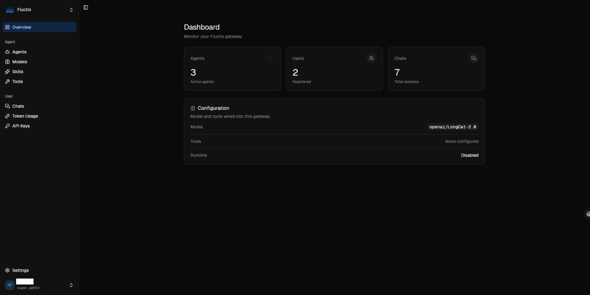
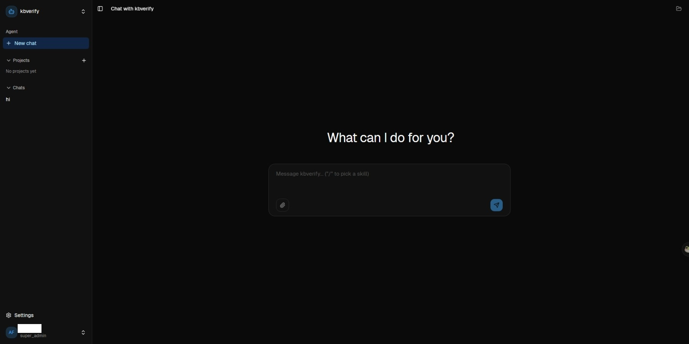
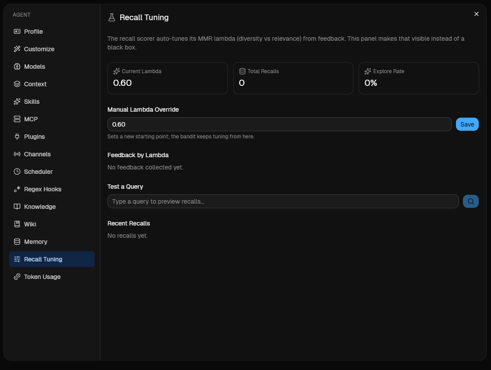

<div align="center">

# Fluctio

A lightweight AI Agent runtime written in Go.

[](https://go.dev)

**Single binary - Any LLM - Multi-agent - Sandbox - Cloud-ready**

[Quick Start](#quick-start) - [Architecture](#architecture) - [Features](#features) - [License](#license)

</div>

---

<p align="center">
  
  <br>
  <em>Platform admin: agents, models, skills, users, API keys</em>
</p>

<p align="center">
  
  <br>
  <em>Per-agent management: chat, customize, scoped models / skills / channels / scheduler</em>
</p>

## What is Fluctio?

Fluctio is an **Agent Factory** — it creates, manages, and runs AI agents. Each agent has its own personality (SOUL.md), memory, skills, and tools. Fluctio handles the LLM communication, tool execution, sandbox isolation, and session management.

```bash
# Install (drops the binary into ~/.local/bin and adds it to PATH)
curl -fsSL https://raw.githubusercontent.com/fluctio-ai/fluctio/main/install.sh | bash
```

## Quick Start

### 1. First Run

```bash
fluctio
# Opens setup wizard → configure LLM provider → creates default agent.
# Foreground mode; ^C to stop. Use `fluctio daemon start` to run in
# the background, or `fluctio daemon install` to register a
# launchd / systemd service.
```

### 2. Dashboard

Open `http://localhost:18953` and login with your admin token.

- **Agents** — Create and manage agents, each with its own personality and model
- **Skills** — Install shared skills from ClawHub or GitHub
- **Models** — Configure LLM providers (OpenAI, Anthropic, Ollama, OpenRouter, etc.)
- **API Keys** — Issue programmatic owner-level credentials
- **Settings** — General (theme), Account (profile + password), Runtime (sandbox config; admin only), Diag (LLM failure reports)

> Single-user mode: the dashboard serves one owner. There is no
> self-registration and no multi-user management — the owner account is
> created via onboarding or `fluctio admin create-user`.

### 3. Agent Management

Click an agent to enter its management panel:

- **Chat** — Talk to the agent (debug/test); conversation auto-titled from the first exchange
- **Files** — Edit SOUL.md, IDENTITY.md, MEMORY.md, etc.
- **Skills** — Agent-private skills
- **Models** — Agent-specific provider + model overrides (shadow system entries by name; agent-scope `agents.defaults.model` overrides the system default)
- **Channels** — Connect IM bots (Telegram, Discord, Slack, Feishu, QQ, WeChat) so end-users can chat with the agent on their platform of choice
- **Scheduler** — Inspect and manage cron jobs the agent created via `create_cron_job` ("每天 9 点提醒我", "5 分钟后叫我"); pause / delete from the UI
- **Knowledge** — The agent's knowledge base: articles / flash notes / todos, LLM-generated wiki pages + graph, daily diary (KB tab → Diary), and dedup pending review
- **Vectorization** — Per-agent embedding + reranker overrides for memory / KB / wiki (inherits system defaults when unset)
- **Recall Tuning** — Observe and steer cross-session recall (MMR λ bandit state, exploration stats, 👍/👎)
- **Context** — Per-agent compaction threshold mode (Conservative / Balanced / Aggressive) + manual override
- **Regex Hooks** — Pattern-triggered CLI shortcuts (e.g. `打卡` → local hook binary)
- **Sessions** — Conversation history

## Architecture

```
~/.fluctio/
  fluctio.db                # SQLite default — users, agents, sessions,
                             # apikeys, configs, agent_files all live here
  skills/                    # Shared skills (bundled + installed)
  agents/
    <agentId>/agent/skills/        # Agent-private skills (filesystem only)
```

The database is the source of truth for everything except skill folders
on disk. SQLite is the default; point `FLUCTIO_STORAGE_DSN` at Postgres
for multi-pod deployments.

**There is no `fluctio.json`.** Bootstrap settings (port, bind, storage
DSN, sandbox backend) come from `FLUCTIO_*` env vars; everything user-
facing (providers, channels, settings, defaults) lives in the `configs`
table and is edited through the dashboard or `fluctio agents config`.

### What Fluctio Stores

| Data | Belongs to | Backing store |
|------|-----------|---------------|
| Agent records, SOUL.md / IDENTITY.md / MEMORY.md / agent.json | Agent | DB (`agent_files` table) |
| Sessions (chat history) | Agent × session | DB (`sessions` table) |
| API keys, scoped configs (providers/channels/settings) | Platform | DB |
| Skills | Agent / Global | Filesystem (`skills/`, `agents/<id>/agent/skills/`) |
| Output files | Application | Your app / S3 |

## Features

### LLM Providers
- OpenAI, Anthropic, Ollama, OpenRouter, Groq, DeepSeek, Mistral, and any OpenAI-compatible API
- Per-agent provider + model override (agent-scope shadows system by name)
- Prompt cache support (RawAssistant preservation)

### Channels
- Per-agent Telegram / Discord / Slack / Feishu bot bindings — end-users chat with the agent on their platform
- Tokens validated before save (Telegram `getMe`, Discord `/users/@me`, Slack `auth.test`)
- Sessions are isolated per channel + chatID, so a user's Telegram thread and Discord thread stay separate
- Feishu supports inbound document/file attachments (delivered to the agent as workspace files)
- QQ Official Bot (WebSocket) — markdown reply mode (msg_type 2 vs 0) is toggleable per account after connect; inbound images materialize into the session workspace
- WeChat (iLink) — scan-once QR enrollment (no paste-in token): scan the QR served at `/api/agents/{id}/channels/wechat/login` with the WeChat phone app, then poll `login/status` until confirmed. Inbound images materialize into the session workspace; `image_gen` outputs are uploaded through the iLink CDN and delivered back as images

### Tools & Sandbox
- Built-in: exec, read_file, write_file, list_dir, web_fetch, web_search, memory_search
- Provider-backed tools (configurable chain, automatic fallback): `image_gen` (gpt-image-1 / fal flux / …), `vision` (multimodal image understanding — reads/transcodes/resizes in-process; auto-routed when the primary model is text-only), `tts` (OpenAI / ElevenLabs / MiniMax / …)
- E2B cloud sandbox or Docker sandbox — automatic skill + workspace hydrate, post-exec sync (sandbox-side files mirrored back to the durable store after every tool call)
- MCP server support
- Plugin system (JSON-RPC subprocess)

### Skills
- Bundled skills: code-runner, image-gen, data-analysis, translation, web-search, skill-creator
- Install from [ClawHub](https://clawhub.ai) or [skills.sh](https://skills.sh)
- Agent-private or globally shared

### Regex Hooks
- Per-agent message interception: a message matching a configured regex bypasses the LLM and runs a CLI command instead (e.g. `打卡` → `hooks/daka-hook.exe`), returning the command's stdout as the reply
- **Context hygiene** — each hook has a *feed to AI context* toggle (off by default). When off, the matched exchange (command + result) is archived with `llm_visible=0`: it still shows in the web chat history, but is filtered out of the LLM working set, conversation summary, recall sweep, and `fetch_messages` tool. Turn it on only for hooks whose output the model should remember on later turns
- Multiple hooks can chain on a single message (*continue on match*); if any matched hook feeds the LLM, the whole turn does

### Memory
- MEMORY.md — long-term facts, auto-updated by heartbeat
- Session-based context with full history preservation
- Thinking/reasoning content preserved for memory extraction
- Cross-session recall via `memory_search` (conversation summaries: FTS + vector KNN + cross-encoder rerank)
- **Anti-enrichment scoring** — three orthogonal axes keep frequently-recalled memories from drowning out fresh/relevant ones:
  - Frequency: log1p-saturated reinforcement (caps the boost from repeated recall)
  - Semantic: Maximal Marginal Relevance (MMR) reranks for a diverse top-K
  - Recency: batch min-max of mean recall time (a single fresh recall can't refresh an otherwise-stale memory)
- **Self-tuning MMR λ (bandit)** — ε-greedy explores the relevance-vs-diversity tradeoff; explicit 👍/👎 and **implicit feedback** (follow-up conversation similarity, swept on a cron) drive λ upgrades with a seesaw non-regression guard. No button-clicking required.
- **Recall Tuning panel** (agent settings → Recall Tuning): observe current λ / recall & exploration counts / per-λ win rate, test a query (full FTS+vector+MMR preview), manually override λ, and 👍/👎 recent recalls



### Knowledge Base & Wiki
- **Three content types** — long-form articles (ingest from text or URL), flash notes (one-line captures), and todos (status + start/due timing). Each agent's KB is isolated to that agent.
- **Agent-facing tools** — `knowledgebase_search` (hybrid semantic + FTS over chunks), `knowledgebase_add` / `knowledgebase_ingest_url`, `knowledgebase_save_flash`, `knowledgebase_save_todo` / `knowledgebase_update_todo` / `knowledgebase_list_todos`, `knowledgebase_list` / `knowledgebase_delete`, plus `knowledgebase_search_raw` for verbatim source passages when the wiki summary isn't detailed enough.
- **Article deep-read (insights)** — one click (or an agent tool call) asks the LLM to produce a structured summary, themes, chapter breakdown, memorable quotes, action items, and "sprouts" (follow-up questions). Stored 1:1 with the article and surfaced in the UI.
- **Three-tier dedup** — L1 source fingerprint → L2 vector similarity (three thresholds) → L3 normalized-title match. Near-duplicates are routed to an LLM `MergeArticles` step; pending merges surface as review cards, and wiki re-indexing is debounced via a dirty flag.
- **Auto-generated Wiki** — the LLM distills KB sources into structured wiki pages (themes, concepts) with `[[type:slug]]` double-links and a live knowledge graph. Regenerated whenever the KB changes; pages are also embedded for vector recall, so KB search falls back to wiki chunks.
- **Shared vectorization** — memory, KB, and wiki ride the same embedding + reranker chain. System defaults live under Settings; per-agent overrides live under the agent's **Vectorization** tab. Reindex buttons cover "missing only" and "force all".

### Daily Diary
- Each agent produces a per-day diary by aggregating that day's conversation summaries (topics + blind spots), pinned to the original `#seq` turns so you can jump straight to the source conversation.
- Agent setting (KB tab → Diary): on/off, daily generation time, thinking mode.
- Frontend: month calendar heat-map (three states — generated / empty-marker / not-yet), a filterable entry list, and `#seq` deep-links into the originating chat. Future dates are disabled.

### Context Compaction
- **Model-aware threshold** — the auto-compaction trigger scales with each model's context window instead of a fixed 80K: `contextWindow − systemPrompt − maxTokens − margin`. Three modes per agent (Conservative 30% / Balanced 15% / Aggressive 10% margin) under agent settings → Context; a manual threshold override is also available. Models with an unknown window fall back to 80K.
- **Builtin metadata table** — 675 models' `contextWindow` + `maxOutputTokens` **+ input/output modalities** (projected from `docs/models.json`) are compiled in. `LookupModelMeta` matches **case-insensitively by substring (longest-first)**, so `openai/LongCat-2.0` resolves through the `longcat` key; `SupportsVision()` decides whether inbound images are inlined as `image_url` blocks (multimodal primary model) or routed through the `vision` tool (text-only primary model).
- **Local override** — `~/.fluctio/model-meta.json` (seeded with a commented example on first run) overrides or supplements the builtin table; same-key local wins. Edit it to add models missing from the builtin table.
- **Compaction notice** — when auto-compaction fires, a persistent `📝 上下文已自动压缩（before → after tokens）` bubble appears mid-conversation (web + IM channels), and is excluded from the LLM-bound message stream so it never pollutes context.

### Diagnostics
- **`fluctio debug why-failed <agent-id> <session-key>`** — attributes the root-cause step of a failed agent turn from the local SQLite DB. It merges the LLM-call and session-event timelines and applies heuristic rules (LLM HTTP failure → tool cascade → empty response → loop) to explain *why* a turn died, not just *what* errored.
- **Web UI error report** (Settings → Diag): generate a deeper, no-PII LLM-layer report for an agent + session + window (default 3 days) — runs the owner's default agent over the same trajectory and renders a downloadable breakdown. Diagnostic data is retained on a separate sweep (`FLUCTIO_LLM_CALL_DIAG_RETENTION_HOURS`, default 72h; `0` disables).

### API
- OpenAI-compatible `/v1/chat/completions` (streaming)
- HTTP API reference: [`docs/upstream-api.md`](docs/upstream-api.md)
- Web chat `/api/chat/stream` (SSE)
- Live agent push via `/api/chat/subscribe` (SSE) — surfaces cron-fired and other async replies into the open chat panel without a refresh
- Session management `/api/chat/sessions`
- Agent CRUD `/api/agents`
- Per-agent scheduler `/api/agents/{id}/cron` (list / toggle / delete)
- Provider management `/api/config`
- Skill install `/api/skills/install` (ClawHub + GitHub)
- API key management `/api/apikeys` (owner-level; single tier)
- Per-owner API key + agent creation via `/api/users/{id}/apikeys` and `/api/users/{id}/agents` (self-service)
- Recall tuning: `/api/agents/{id}/recall-tuning` (GET bandit state / PUT manual λ), `/api/agents/{id}/recall-test` (query preview), `/api/agents/{id}/recall-events` (recent recalls), `/api/chat/recall-feedback` (👍/👎)
- Knowledge base: `/api/agents/{id}/kb/...` — sources, ingest (text / URL), entries, search, stats, insights + generate, flash, todo + list-todos, pending review + resolve
- Wiki: `/api/agents/{id}/wiki/...` — stats, pages, graph, generate, reindex-embed, progress, autogen-status
- Daily diary: `/api/agents/{id}/diary` (list / get / generate)
- Vectorization: system `/api/vectorization` (GET / PUT); per-agent `/api/agents/{id}/vectorization` (GET / PUT)
- Diagnostics: `/api/diag/reports` (generate / list / download)

## Configuration

Bootstrap is **env-only**. Everything that needs to change at runtime
(providers, models, channels, defaults, sandbox toggle) lives in the
database and is edited through the dashboard or `fluctio agents config`.

### Owner account (first-run identity)

Single-user mode is **opt-in via declaring the owner**. At boot the
gateway upserts the declared owner and enforces it as the only
super-admin, so the platform comes up ready to log in — no web
onboarding step required. Declare it in any of these ways (priority
high → low):

1. `FLUCTIO_OWNER_JSON` — one JSON string: `{"username":"...","password":"...","email":"...","displayName":"..."}`
2. The four individual vars below (ignored when `FLUCTIO_OWNER_JSON` is set)
3. `<FLUCTIO_HOME>/owner.json` — same JSON shape, file on disk
4. Fall back to web onboarding / `fluctio agents init` (creates `admin` with a random password printed once)

| Env var | Default | What it does |
|---|---|---|
| `FLUCTIO_OWNER_JSON` | empty | Owner identity as one JSON string; highest priority, overrides the four vars below. |
| `FLUCTIO_USERNAME` | empty | Owner username (when `FLUCTIO_OWNER_JSON` is unset). |
| `FLUCTIO_PASSWORD` | empty | Owner password (when `FLUCTIO_OWNER_JSON` is unset). |
| `FLUCTIO_EMAIL` | empty | Owner email (optional). |
| `FLUCTIO_DISPLAY_NAME` | empty | Owner display name (optional). |

### Bootstrap env

| Env var | Default | What it does |
|---|---|---|
| `FLUCTIO_HOME` | `~/.fluctio` | Where the SQLite DB, skill folders, and `owner.json` live. |
| `FLUCTIO_PORT` | `18953` | Gateway HTTP port. |
| `FLUCTIO_BIND` | `loopback` | `loopback` (127.0.0.1) or `all` (0.0.0.0). |
| `FLUCTIO_DEPLOY` | empty | `hosted` marks a hosted multi-tenant deploy (disables `host_exec`, flips hosted-only code paths); unset or any other value = self-hosted. |
| `FLUCTIO_ALLOW_HOST_EXEC` | empty (off) | `1` / `true` / `yes` registers the `host_exec` escape-hatch tool. Forced off when `FLUCTIO_DEPLOY=hosted`. |
| `FLUCTIO_STORAGE_TYPE` | `sqlite` | `sqlite` or `postgres`. |
| `FLUCTIO_STORAGE_DSN` | empty | Postgres DSN, e.g. `postgres://u:p@host:5432/db?sslmode=disable`. Empty = sqlite at `$FLUCTIO_HOME/fluctio.db`. |
| `FLUCTIO_STORAGE_AUTO_MIGRATE` | `true` | Apply schema migrations on boot. |
| `FLUCTIO_REDIS_ENABLED` | `false` | Enable Redis-backed channel leases and Redis Stream message bus. Setting `FLUCTIO_REDIS_ADDR` also enables it. |
| `FLUCTIO_REDIS_ADDR` | `127.0.0.1:6379` when enabled | Redis address used by multi-replica channel locks and shared inbound/outbound delivery streams. |
| `FLUCTIO_REDIS_USERNAME` | empty | Redis ACL username, if required. |
| `FLUCTIO_REDIS_PASSWORD` | empty | Redis password, if required. |
| `FLUCTIO_REDIS_DB` | `0` | Redis logical database number. |
| `FLUCTIO_REDIS_PREFIX` | `fluctio` | Prefix for Redis stream and lease keys. |
| `FLUCTIO_SANDBOX_ENABLED` | dashboard | Override the Settings → Runtime toggle. |
| `FLUCTIO_SANDBOX_BACKEND` | dashboard | `docker`, `e2b`, or `boxlite`. Setting it implies sandbox enabled. |
| `FLUCTIO_SANDBOX_IMAGE` | dashboard | Docker image (Docker backend) or template id (E2B). |
| `FLUCTIO_SANDBOX_BOXLITE_URL` | empty | BoxLite backend base URL, e.g. `https://api.boxlite.ai/v1`. |
| `FLUCTIO_SANDBOX_BOXLITE_CLIENT_ID` | `default` | BoxLite client id. |
| `FLUCTIO_SANDBOX_BOXLITE_PREFIX` | `default` | BoxLite workspace prefix. |
| `E2B_API_KEY` | empty | E2B API key (E2B backend). Not `FLUCTIO_`-prefixed. |
| `BOXLITE_API_KEY` | empty | BoxLite API key sent as `Authorization: Bearer`. Not `FLUCTIO_`-prefixed. |
| `FLUCTIO_OBJECT_STORE_TYPE` | empty | Object-store backend type for distributed deploys (multi-pod skill / file hydration). |
| `FLUCTIO_OBJECT_STORE_LOCAL_ROOT` | empty | Local filesystem root (local backend). |
| `FLUCTIO_OBJECT_STORE_REGION` | empty | S3 / compatible region. |
| `FLUCTIO_OBJECT_STORE_BUCKET` | empty | S3 / compatible bucket. |
| `FLUCTIO_OBJECT_STORE_PREFIX` | empty | Key prefix inside the bucket. |
| `FLUCTIO_OBJECT_STORE_ACCESSKEY` | empty | S3 / compatible access key. |
| `FLUCTIO_OBJECT_STORE_SECRETKEY` | empty | S3 / compatible secret key. |
| `FLUCTIO_OBJECT_STORE_ACCOUNTID` | empty | Account id (e.g. Cloudflare R2). |
| `FLUCTIO_OBJECT_STORE_ENDPOINT` | empty | S3-compatible endpoint URL. |
| `FLUCTIO_OBJECT_STORE_USESSL` | empty | `true` / `1` to enable TLS. |
| `FLUCTIO_OBJECT_STORE_ALIYUN_INTERNAL` | empty | `true` / `1` to use the Alibaba Cloud internal endpoint. |
| `FLUCTIO_LOG_LEVEL` | `info` | `debug` / `info` / `warn` / `error`. |
| `FLUCTIO_DEBUG_MODE` | empty (off) | `true` / `1` for verbose debug output (prompt dumps, request traces). |

### Runtime tuning

| Env var | Default | What it does |
|---|---|---|
| `FLUCTIO_SESSION_EVENTS_RETENTION_HOURS` | `168` (7 days) | `session_events` sweep window; `0` disables pruning. |
| `FLUCTIO_LLM_CALL_DIAG_RETENTION_HOURS` | `72` (3 days) | LLM-call diagnostic sweep window; `0` disables pruning. |
| `FLUCTIO_SEARXNG_ENDPOINT` | empty | SearXNG instance URL. When no `web_search` chain is configured, setting this synthesizes a one-provider SearXNG chain. |
| `FLUCTIO_DUMP_LLM` | empty (off) | Non-empty enables dumping every LLM request payload to disk. |
| `FLUCTIO_DUMP_LLM_FILE` | empty | Dump file path; defaults to a file under `$FLUCTIO_HOME`. |
| `FLUCTIO_PLUGIN_CHAT_SEND_DELAY_MS` | `50` | Delay (ms) before a plugin's `chat.send` is pushed to the outbound bus. |
| `FLUCTIO_ANTHROPIC_CACHE_TTL` | `1h` | TTL on Anthropic prompt-cache breakpoints; `5m` restores the short default (cross-hour IM wakes then miss the cache). |

Credential-bearing vars (`FLUCTIO_STORAGE_DSN`, `FLUCTIO_OBJECT_STORE_*`
secrets, `FLUCTIO_REDIS_PASSWORD`, `E2B_API_KEY`, `BOXLITE_API_KEY`) are
scrubbed from the daemon's environment after bootstrap — agent
subprocesses can't recover them via the parent env. Treat env as a
one-time bootstrap override; rotate credentials at runtime via the
admin UI.

Anything not on this list — providers, models, default model, skill
catalog, channels, plugin config, scheduler — is configured at runtime
through the web UI (`http://localhost:18953`) or the CLI (`fluctio
agents config`, `fluctio provider`, `fluctio skill`).

## Deployment

### Local

```bash
fluctio                    # foreground (^C to stop)
fluctio daemon start       # background (logs at ~/.fluctio/daemon.log)
fluctio daemon status
fluctio daemon stop
fluctio daemon install     # register as a launchd / systemd service
```

### Manage agents from the CLI (`fluctio agents …`)

The `fluctio agents` subcommand is a thin convenience wrapper around the
same store the dashboard uses. Agents you create here show up in the web
UI and vice-versa — there's only ever one fluctio deployment per
`FLUCTIO_HOME`.

```bash
# Zero to a chattable agent in one command. On a fresh install this
# creates an `admin` user (random password printed once) and starts
# the gateway daemon if it isn't already running.
fluctio agents init alpha \
  --provider openai \
  --model openai/gpt-4o-mini \
  --api-key-env OPENAI_API_KEY

# Set per-agent overrides (model, temperature, sandbox, …).
fluctio agents config alpha set temperature 0.7
fluctio agents config alpha set sandbox.enabled true

# Upload the agent's identity files.
fluctio agents files put alpha SOUL.md ./SOUL.md
fluctio agents files put alpha IDENTITY.md ./IDENTITY.md

# Inspect.
fluctio agents ls
fluctio agents config alpha get
fluctio agents files ls alpha

# Tear down.
fluctio agents rm alpha
```

The CLI opens the operator's store directly (sqlite at
`~/.fluctio/fluctio.db`, or whatever `FLUCTIO_STORAGE_DSN` points at)
and writes through the same code paths the gateway uses. It does not
require the gateway to be running — but `agents init` will spin one up
in the background so a fresh agent is immediately reachable at
`http://localhost:18953`. Subsequent CLI writes (`config set`,
`files put`, `rm`, `init` re-runs) send `SIGHUP` to the running gateway
so it hot-reloads without restart. Windows lacks `SIGHUP` delivery, so
the CLI falls back to a hint asking you to run `fluctio daemon restart`.

The default owner is the `admin` user. On an empty database
`agents init` creates that account with a generated password (printed
once); on a populated database it expects `admin` to exist or
`--username` to point at an existing user.

#### Resolving agents

CLI commands accept either a display name or an `agt_…` id:

- `fluctio agents config alpha get` — by display name (must be unique)
- `fluctio agents config agt_d3c4a5… get` — by id

If the same text matches one agent's id and a different agent's display
name, the CLI reports an ambiguity instead of guessing.

When you create an agent via `agents init <name>`, the name is the
display name and the id is auto-generated. To update an agent that was
created via the dashboard, pass its id explicitly:

```bash
fluctio agents init "Cool Agent" --id agt_d3c4a5...
```

#### Configuration keys

Per-agent (saved at `scope=agent` under the agent's id):

- `model`, `temperature`, `maxTokens`, `thinking`, `policy`
- `sandbox`, `sandbox.enabled`, `sandbox.backend`, `sandbox.image`, `sandbox.network`

System-wide (saved at `scope=system`):

- `plugins`, `plugins.<name>`
- `skills.install`, `skills.entries`, `skillsLearner`
- `tools.providers`, `tools.categories`
- `objectstore`, `taskqueue`, `heartbeat`, `memory`, `privacy`, `hooks`, `teams`

Provider configs live in `scope=system` and are addressed as
`provider.<name>.<field>`:

```bash
fluctio agents config alpha set provider.openai.apiKeyEnv OPENAI_API_KEY
fluctio agents config alpha set provider.openrouter.apiBase https://openrouter.ai/api/v1
fluctio agents config alpha set provider.openai.model gpt-4o      # adds; idempotent
fluctio agents config alpha set provider.openai.models '[]'        # explicit clear
```

Provider presets ship for `openai`, `openrouter`, `anthropic`, `ollama`,
`groq`, `deepseek`, `mistral` — `--api-key-env` populates `apiKey` from
the named environment variable, the rest comes from the preset.

#### Agent system files

The CLI reads and writes the same `agent_files` table the dashboard's
file editor uses. Allowlisted filenames: `SOUL.md`, `IDENTITY.md`,
`USER.md`, `BOOTSTRAP.md`, `MEMORY.md`, `HEARTBEAT.md`, `AGENTS.md`,
`TOOLS.md`, `agent.json`.

| Subcommand | Purpose |
|---|---|
| `agents init <name>` | Create or update an agent (provider/model/sandbox/files) |
| `agents ls` | List all agents in the store |
| `agents config <name> get\|set [key] [value]` | Read or update a config value |
| `agents files ls\|put\|get <name>` | Read / write the agent's system files |
| `agents rm <name>` | Delete the agent record and its system files |

### Manage API keys from the CLI (`fluctio apikey …`)

Issue and manage programmatic owner-level credentials for external
integrations. Every key has full owner scope — single-user mode has no
key tiers and no per-agent ACL.

```bash
# Create a key (token shown once — save immediately)
fluctio apikey create --name "my-key" [--owner <user-id>]

# List keys for a user (defaults to first super_admin)
fluctio apikey list [--owner <user-id>]

# Delete a key
fluctio apikey delete --id <apikey-id>

# Rotate a key (old token invalidated, new token shown once)
fluctio apikey rotate --id <apikey-id>
```

**Flags:**
- `--name` (required): human-readable key name
- `--owner` (optional): owner user ID; defaults to first super_admin

### Docker
```bash
cd deploy/docker && ./start.sh
```

### Kubernetes

```yaml
env:
  - name: FLUCTIO_BIND
    value: "all"
  - name: FLUCTIO_STORAGE_TYPE
    value: "postgres"
  - name: FLUCTIO_STORAGE_DSN
    valueFrom:
      secretKeyRef:
        name: fluctio-db
        key: dsn
  - name: FLUCTIO_OBJECT_STORE_ENDPOINT
    value: "s3.amazonaws.com"
  - name: FLUCTIO_OBJECT_STORE_BUCKET
    value: "fluctio-skills"
```

No config file is mounted — bootstrap is env-only. See `deploy/k8s/`
for full manifests.

## Building

```bash
make build                  # builds the web bundle and the Go binary → bin/fluctio
make install                # installs to $HOME/.local/bin (override with PREFIX=)
make release-local          # cross-compile darwin / linux / windows into dist/
```

The Makefile bakes the version, commit, and build date into the binary
via `-ldflags`. CI uses these targets too — see `.github/workflows/`.

## License

Fluctio is **source-available** under the [Fluctio Community License](LICENSE),
based on Apache License 2.0 with additional conditions.

**TL;DR:**
- ✅ Use it commercially as a backend for your own product
- ✅ Internal deployment within your organization
- ❌ Hosting Fluctio as a multi-tenant SaaS for unrelated organizations
  (without a commercial license)
- ❌ Removing or modifying the Fluctio branding in the dashboard UI

The full Apache 2.0 text is reproduced inside the [LICENSE](LICENSE) file
under the addendum.
